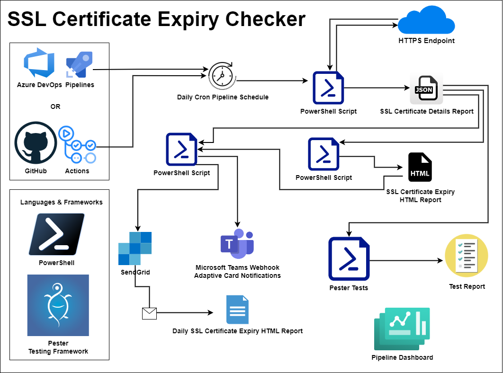
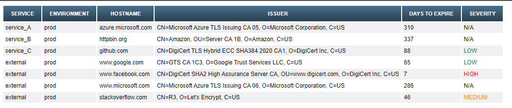
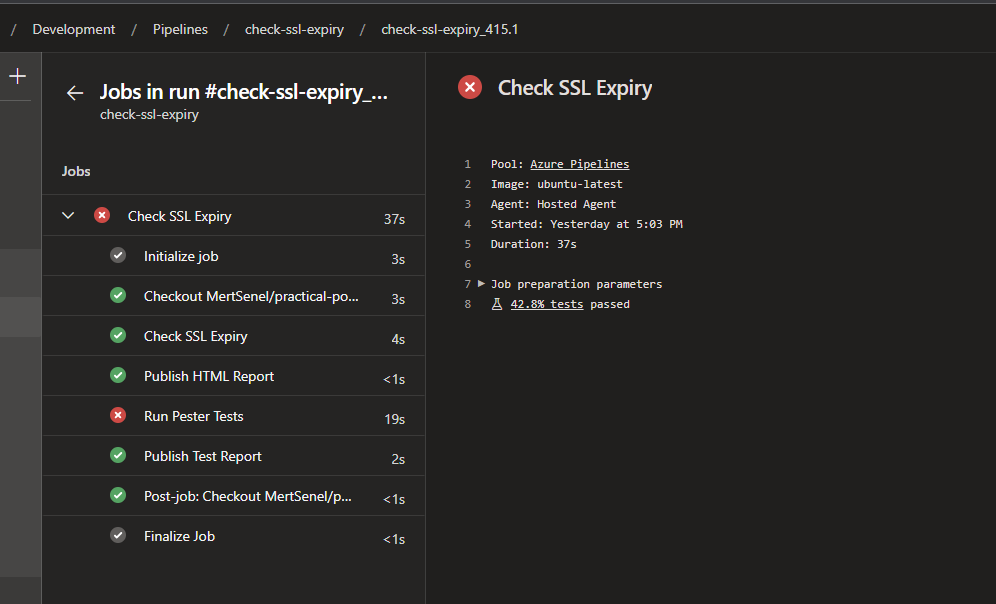
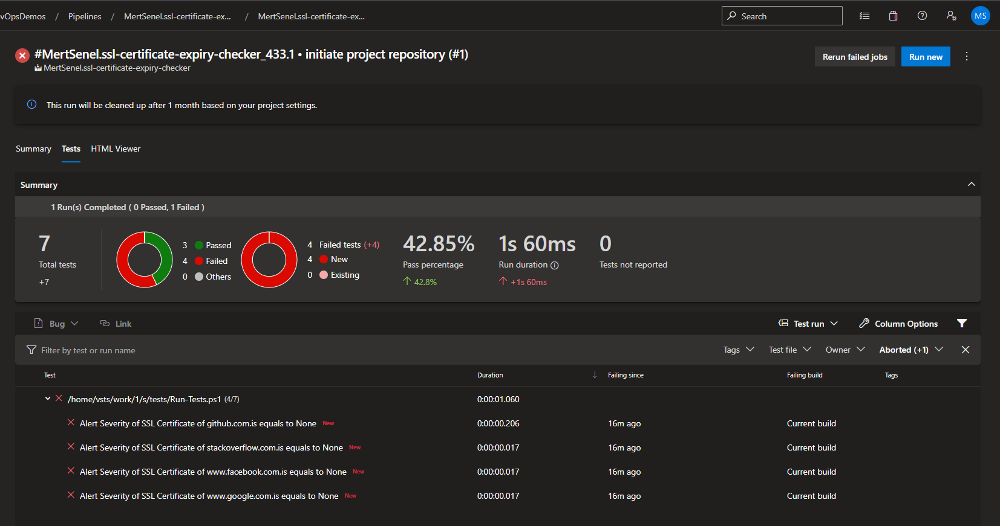
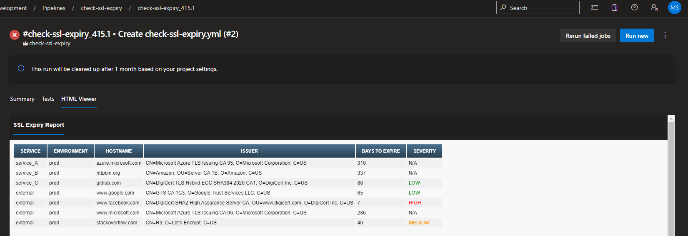
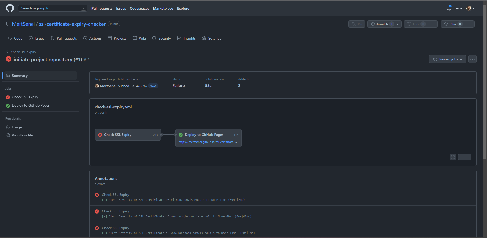
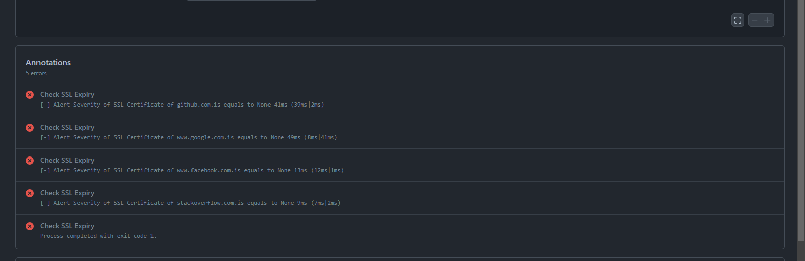
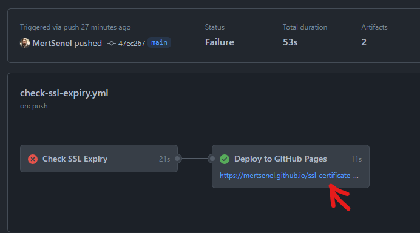

# SSL Certificate Expiry Checker

**Track Your SSL Certificate Expiry Dates via CI/CD Pipelines**

**Custom HTML Report Sample**

## Background

Operation teams are responsible for rotating SSL certificates of the services they are responsible for which have HTTPS endpoints.
Although it's better to automate the full rotation process, this may not always possible. Regardless of the rotation process a regular check can help with keeping on top of overall SSL certificate health, expiry being the most important metric. We also know that, as of 2020 most certificate authorities limit their maximum validity period for newly issues certificates to 1 year. This adds a big burden to teams which are responsible for multitude of domain names and SSL certificates issued for relevant subject names.

## Solution Design

The main focus of this project is to perform a regular check to your HTTPS endpoints and check the expiry date of your SSL certificates used by that endpoint. The full certificate object is being collected, in this implementation I am only reporting based on expiry dates but other checks can be added as well. The reason to use CI/CD pipelines hence agents is to allow operation teams to run these tests with runners/agents that has the network line of sight to both their public facing and internal origin endpoints.

This tool will do a TCP based retrieval for the SSL certificate of remote endpoint and holds generates a report in JSON format. Afterwards this JSON report is used to generates a custom HTML report for publishing and to be used as a body of an HTML based notification. The pipelines will also generate a test report in JUnitXml for easier reporting of pipeline run status and reporting.

The solution has a pipeline/workflow sample for both Azure DevOps Pipelines and Github Actions based on your choice of CI/CD tooling. Both has different capabilities but both are popular and valid choices.

Customizable within the utility scripts, the current alerting thresholds and color codes are based on table below.

|Alert Threshold in Days  | Severity  |
|:-----------------------:|:---------:|
|90                       | Low |
|60                       |   Medium |
|30                       |    High |

### Azure DevOps Pipelines

- Cron Schedule, allowing for periodic checks, reporting and alerting
- [HTML Viewer](https://marketplace.visualstudio.com/items?itemName=JakubRumpca.azure-pipelines-html-report&targetId=c847560f-17a1-4ef2-a8c2-af353ae8846e&utm_source=vstsproduct&utm_medium=ExtHubManageList) extension is used to view the HTML report as a pipeline result
- Pester Test results are reported in the pipeline for seeing if any of the endpoints checked has an SSL certificate with expiry date within alerting periods.
- The test results are also allows us to report on pipeline's result status. An easy way for getting notified from the pipeline can be achieved via subscribing to the pipeline's results in various ways Azure DevOps has native integration such as email, or Microsoft Teams Azure DevOps bot. 
- Alternative e-mail based or webhook based notifications can be added via the utility script `Send-Notifications.ps1`.

#### Sample Azure DevOps Pipeline Run Screenshots

**Sample Azure DevOps Pipeline Run**

**Sample Azure DevOps Pipeline Run Test Results**

**Sample Azure DevOps Pipeline Run Custom HTML Report**

### GitHub Actions

#### Sample GitHub Actions Workflow Run Screenshots

- Cron Schedule, allowing for periodic checks, reporting and alerting
- As HTML Viewer extension is not available for GitHub Actions, publishing report to GitHub Pages has been used as an alternative. **GitHub Pages requires either a public repository or a paid GitHub Account, if wished to be used in a private repository.**
- Pester Test results are reported in the pipeline for seeing if any of the endpoints checked has an SSL certificate with expiry date within alerting periods.
- The test results are also allows us to report on pipeline's result status. An easy way for getting notified from the pipeline can be achieved via subscribing to the pipeline's results in various ways Azure DevOps has native integration such as email, or Microsoft Teams HitHub integration bot.
- Alternative e-mail based or webhook based notifications can be added via the utility script `Send-Notifications.ps1`.

**Sample GitHub Actions Workflow Run**

**Sample GitHub Actions Workflow Run Test Results**

**Sample GitHub Actions Workflow Run Custom HTML Report**

## Usage

1. Fork or Create your own Clone of this Repository
2. Update `endpoints.json` with your own endpoints
3. Setup your GitHub Actions Workflow and/or Azure DevOps Pipeline in your repository or Azure DevOps project.
4. ****Optional:**** Update the `alertThresholds.json` with your own defined values. This config file defines how many days of expiry left are marked as Low, Medium and High alerting severities.
5. **Optional:** If some of the endpoints in your list consists of network protected endpoints, not accessible to Microsoft hosted Azure DeVOps Pipelines or GitHub Actions Runners, please update the agent configuration as needed to use your self-hosted agents.
6. **Optional:** Update the Cron Schedule expression as required.
7. **Optional:** Update the `Send-Notifications.ps1` script to directly send notifications from the pipeline. This may require you to also pass secret(s) to your pipeline in order to use the communication integrations.

## Contributions & Issues

Contributions are welcomed, please raise a Pull Request with your proposed modifications if you wish to make any changes.
If you find an Issue and wish to report it, please use the Issues section.

## License

MIT Licensed, please see [license](LICENSE.md) for details.
